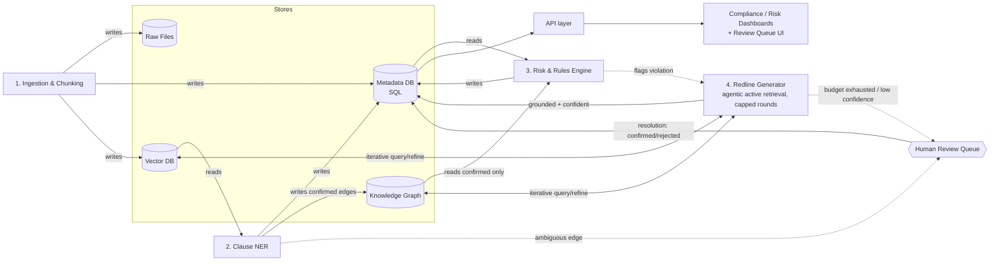

# Architecture — Enterprise Legal Intelligence, Contract Risk & Compliance Copilot

Status: **design only** — no implementation yet. Stack, hosting, and LLM provider are
intentionally undecided (see [Open Decisions](#8-open-decisions)).

Two agentic patterns have been adopted into the design — **Agentic Active Retrieval**
and **Human-in-the-Loop Escalation** (§4). The rest of the pipeline stays a fixed,
deterministic sequence on purpose, to preserve audit provenance — see the reasoning in
§4's closing note and §7.

A rendered diagram of the original (pre-agentic-layer) design lives at
[`docs/architecture/overview.svg`](docs/architecture/overview.svg) — the Mermaid diagram
in §5 below is the current source of truth until that SVG is redrawn.

## 1. Design principle

Each pipeline stage reads only the store(s) it actually needs and writes only the
store(s) that own its output. No stage re-derives another stage's data from raw text —
downstream stages consume upstream structured output. This keeps the system explainable:
every fact and every AI output can be traced back to the specific store, stage, and
(ultimately) source clause that produced it.

Agentic behavior is deliberately scoped to *within* two individual stages (§4) rather
than applied as a general cross-stage orchestrator — that keeps the pipeline's overall
control flow deterministic and auditable even though individual stages now loop and can
defer to a human.

## 2. Storage layer

| Store | Owns | Written by | Read by |
|---|---|---|---|
| **Raw Files** | Original PDF/DOCX/scanned bytes, at rest, access-controlled | Ingestion | Ingestion only (never read downstream — everything past stage 1 works off derived data) |
| **Metadata DB (SQL)** | `Document`, RBAC tags, extracted clauses/facts, risk scores, audit trail, redline output, human review queue + confirmation flags | Ingestion, Clause NER, Risk Engine, Redline Generator, Human Review resolution | Risk Engine, Redline Generator, frontend/API |
| **Vector DB** | Chunk embeddings for semantic retrieval | Ingestion | Clause NER, Redline Generator (iteratively — §4.1) |
| **Knowledge Graph** | Explicit structural relationships between clauses (overrides, depends-on, waives) | Clause NER | Risk Engine, Redline Generator (iteratively — §4.1) |

Raw Files is intentionally a dead end for everything after ingestion — this is what
prevents the Redline Generator from silently re-reading unvetted source text instead of
the structured facts/graph that the Risk Engine already validated.

## 3. Pipeline stages

### 3.1 Ingestion & Chunking
Establishes initial state across every store. Nothing downstream exists until this runs.

- **Writes → Raw Files**: stores the original document securely.
- **Writes → Metadata DB**: creates `Document_ID`, upload timestamp, initial RBAC tags.
- **Writes → Vector DB**: chunks text (OCR first, for scanned input) and stores embeddings.
- Emits `Document_ID` as the join key every later stage anchors to.

### 3.2 Clause NER (Extraction)
Converts unstructured chunks into structured legal facts and relationships.

- **Reads ← Vector DB**: semantic chunks, to identify entities (dates, monetary values,
  organizations, obligations).
- **Writes → Metadata DB**: structured facts (`liability_cap: $1,000,000`,
  `jurisdiction: New York`, obligation + timeline records).
- **Writes → Knowledge Graph**: structural relationships between clauses (e.g. `Section
  4.1 --OVERRIDES--> Section 2.2`).
- **Ambiguity handling**: if an extracted relationship is ambiguous or conflicts with an
  existing edge (e.g. unclear whether Section 4 waives or modifies Section 2), this stage
  does **not** guess — it writes the candidate edge with `status=pending_review` and
  escalates to the Human Review Queue (§4.2) instead of committing an unconfirmed edge
  the Risk Engine would otherwise trust blindly.

### 3.3 Risk & Rules Engine
Purely deterministic — never touches raw text or embeddings, only structured facts and
graph relationships. This is what makes its output auditable and reproducible.

- **Reads ← Metadata DB**: extracted clauses + the org's compliance playbook (assumed to
  live in the same DB as versioned rule records, not hardcoded).
- **Reads ← Knowledge Graph**: walks dependency edges to check whether a candidate risk
  is conditionally waived/overridden elsewhere before flagging it. Only `confirmed` edges
  are trusted for this check — `pending_review` edges are treated as absent until resolved.
- **Writes → Metadata DB**: risk severity scores + audit trail, keyed to the specific
  clause/fact/rule that triggered them.

### 3.4 Redline Generator
Generative stage, triggered only by a Risk Engine flag. Needs the deepest context of any
stage, and is the highest hallucination-risk component in the system — this is why it's
the primary target for the agentic layer in §4.1.

- **Reads ← Vector DB / Knowledge Graph, iteratively** (§4.1): rather than a single static
  retrieval, the agent loops — query, evaluate whether grounding is sufficient, refine and
  re-query — up to a fixed round budget, before generating.
- **Writes → Metadata DB**: suggested alternative wording, supporting rationale,
  confidence score, and the full retrieval trace — served to the frontend. If grounding
  or confidence is insufficient, it writes an escalation instead (§4.2), never an
  unconfirmed redline.

## 4. Agentic layer

### 4.1 Agentic Active Retrieval — Redline Generator
Replaces static top-k retrieval with a bounded search loop, scoped entirely inside this
one stage (it does not change the pipeline's cross-stage control flow).

- **Trigger**: Risk Engine flags a clause for redline.
- **Loop**: query Vector DB + Knowledge Graph → evaluate whether the agent has everything
  it needs (e.g. definitions of capitalized terms referenced in the clause, all relevant
  KG constraints) → if not, issue a refined follow-up query targeting the specific gap.
- **Budget**: capped at a fixed number of rounds (exact N is an open decision, §8) so a
  single redline can't loop indefinitely and blow out latency/cost.
- **Exit conditions**:
  1. Sufficient grounding reached → generate redline + confidence score → write to
     Metadata DB.
  2. Budget exhausted, still insufficient grounding → escalate to Human Review Queue
     (§4.2) — do **not** write an unconfirmed redline.
  3. Redline generated, but confidence falls below threshold even with full grounding →
     escalate to Human Review Queue for approval before it's served to the frontend.
- Every round is logged (query issued, what was returned, whether it closed the gap) —
  this retrieval trace becomes part of the audit record for the eventual redline, which
  is what makes an agentic (non-static) retrieval process still explainable after the
  fact.

### 4.2 Human-in-the-Loop Escalation
The safety net for the one failure mode active retrieval cannot solve on its own:
ambiguity that lives in the source material itself, not missing context a search can find.

- **Escalation sources**:
  (a) ambiguous/conflicting Knowledge Graph edges from Clause NER (§3.2),
  (b) exhausted retrieval budget in the Redline Generator (§4.1),
  (c) a generated redline with confidence below threshold (§4.1).
- **Mechanism**: the escalated item is written to Metadata DB with `status=pending_review`
  and surfaced in a review queue (UI is part of the Compliance Dashboard deliverable,
  not yet designed).
- **Resolution**: a human reviewer approves, corrects, or rejects. The resolution is
  written back with `status=confirmed`/`rejected`, plus `reviewer_id` and `timestamp` —
  this becomes a permanent, distinctly-tagged part of the audit trail (human-confirmed
  facts are never indistinguishable from AI-generated ones).
- **Write-back policy** (open decision, §8): whether a confirmed correction is also
  stored as a reusable fact (e.g. "this defined term always resolves to X in this
  document") so an equivalent ambiguity doesn't re-trigger escalation later in the same
  document. Leaning toward yes, but this needs a `confirmed-by-human` provenance flag in
  the schema either way.

Together, §4.1 and §4.2 directly address the two highest risks originally flagged in §7
(Knowledge Graph reliability, redline grounding) without touching the Risk Engine or
making the pipeline's *stage order* non-deterministic — the looping and the human
deferral both happen inside a stage's own boundary, not across stages.

## 5. Data flow diagram

## 6. Explainability mapping

Every requirement from the brief's "Explainable Legal AI" section maps to a specific
store field, not a free-text LLM claim:

| Requirement | Source |
|---|---|
| Clause references | `Document_ID` + clause span, set at ingestion, carried through every stage |
| Confidence scores | Emitted by Clause NER (extraction confidence) and Redline Generator (rewrite confidence), stored in Metadata DB |
| Supporting legal rationale | Risk Engine's rule match + Knowledge Graph path that triggered the flag |
| Cross-reference links | Knowledge Graph edges, surfaced directly, not re-derived by the LLM at read time |
| Risk severity | Risk Engine output, deterministic, versioned against the playbook rule that produced it |
| Suggested alternative wording | Redline Generator output, always paired with its rationale + confidence, never shown alone |
| Retrieval trace | Every round of the Redline Generator's active retrieval loop (§4.1), stored alongside the redline it produced |
| Human review outcome | Metadata DB `pending_review`/`confirmed`/`rejected` status + `reviewer_id` + `timestamp`, written by Human Review Queue resolution (§4.2) |

## 7. Known risks in this design (flag before building)

- **KG edge extraction reliability** — *mitigated* by §4.2: ambiguous edges no longer get
  committed as fact, they escalate. Still open: the review queue UI doesn't exist yet,
  and escalation thresholds need real data to tune, not a guess.
- **Redline Generator grounding/hallucination** — *mitigated* by §4.1 + §4.2: the agent
  now has to prove it's grounded (or escalate) before writing a redline. Still open:
  the retrieval round budget and confidence threshold are both unset numbers (§8) — set
  too loose and hallucination risk returns, set too tight and the review queue floods.
- **Human Review Queue can become a bottleneck at enterprise scale** *(new risk introduced
  by §4.2)* — if thresholds are miscalibrated toward over-escalation, the "automation"
  becomes a queue-everything system that defeats its own purpose. This needs tuning
  against real document volume, not a fixed number picked up front.
- **RBAC tags applied at ingestion are a label, not enforcement.** Access control must
  also be checked at the API/query layer on every read of Metadata DB / Vector DB / KG,
  or the tags are decorative.
- **The compliance playbook needs a real rule schema** (versioned, structured — e.g.
  condition → clause pattern → severity), not just "check against policy" — the Risk
  Engine can only be deterministic if the playbook itself is structured data, not prose.
- **OCR quality gates Clause NER accuracy** for scanned documents — garbage OCR silently
  degrades every downstream stage with no error surfaced unless ingestion tracks and
  exposes OCR confidence per page.

## 8. Open decisions

Deliberately not decided yet — pick these before writing code:

- **Stack**: backend language/framework, Postgres vs SQLite, vector DB choice (Chroma /
  pgvector / other), graph store (NetworkX in-process vs Neo4j), frontend framework.
- **LLM provider**: which model(s) power Clause NER and Redline Generator, and whether
  calls are live or mocked during early development.
- **Deployment target**: local-only prototype vs hosted.
- **Playbook rule schema**: exact structure for compliance rules in the Metadata DB, and
  how rules get evaluated against extracted facts (matcher engine, precedence rules).
- **Retrieval round budget** (§4.1): max number of query/refine rounds before forced
  escalation.
- **Confidence threshold** (§4.1): score below which a generated redline auto-escalates
  instead of being served.
- **Write-back policy** (§4.2): whether a human's correction becomes a reusable
  confirmed fact for future ambiguity in the same document, or is one-off.
- **Review Queue UI**: ownership/design, as part of the Compliance Dashboard deliverable.
- **Multi-jurisdiction / negotiation / voice bonus features**: out of scope until the
  core 4-stage pipeline + agentic layer is working end-to-end on the primary flow above.

claude ignore this part!
notes for later :) by ur truly why  cause i am too lazy to included this in this

 find a solution to  kg egde whoever is working on it !!!
 maybe we can add optional  verfication as a feature
 the guy who works  do clarify how rules in the Metadata DB will be evaluated against extracted facts
